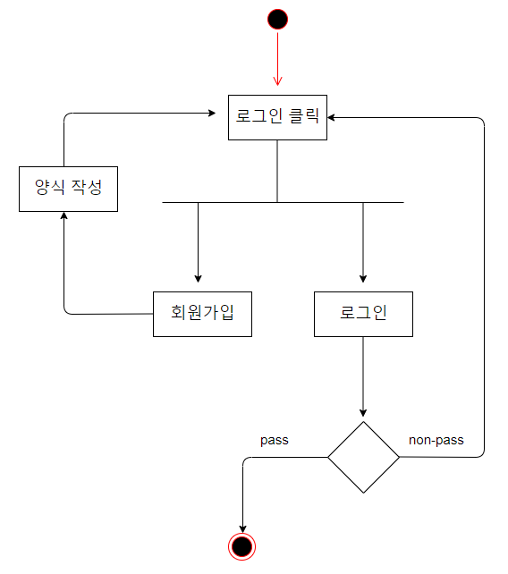
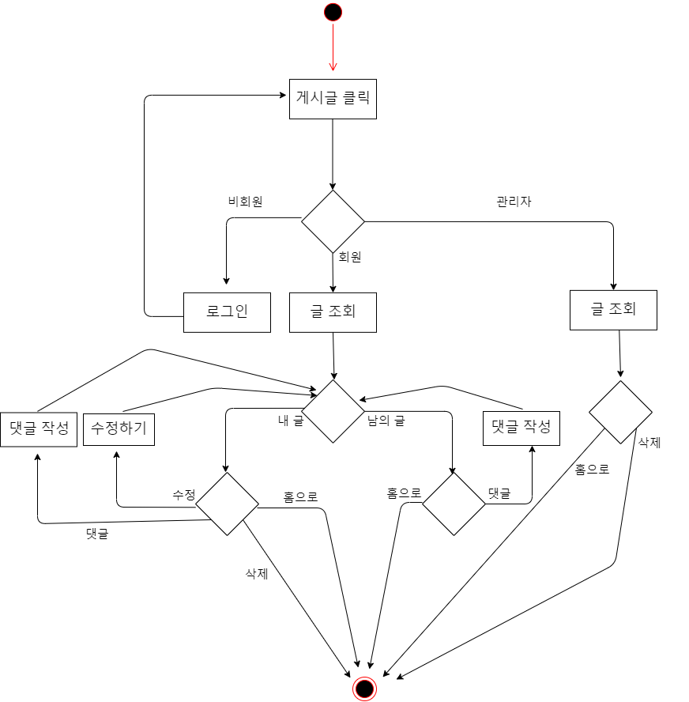
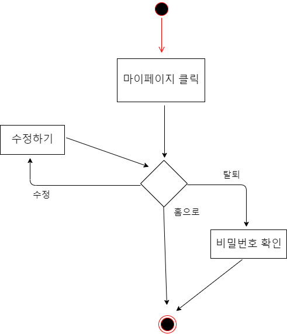
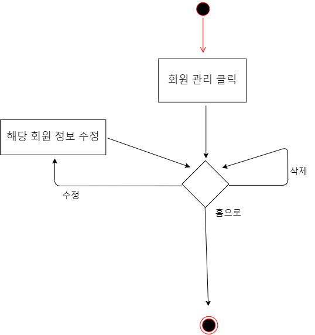
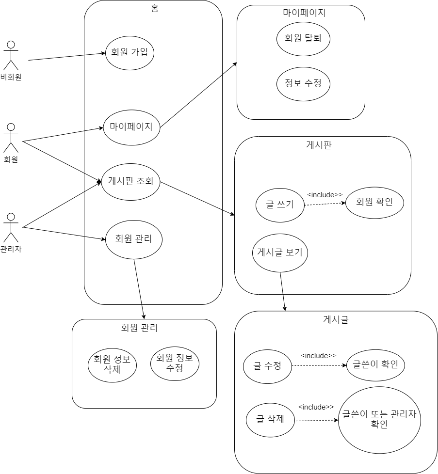
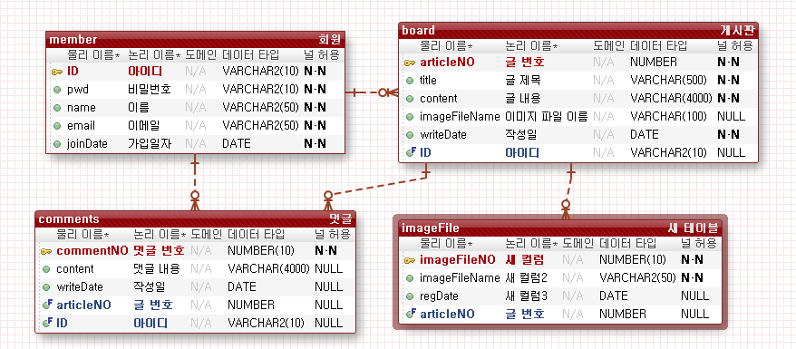

# 두 번째 게시판 만들기

---

## Intro

---

서블릿과 JSP로 구현했던 [첫 게시판 프로젝트](https://github.com/ITHwang/first-board-proj)에 이어, 스프링을 배운 이 시점에 보다 나은 게시판을 구현하려고 합니다.

## Tools

---

<table>
	<tr>
		<td></td>
		<td></td>
		<td></td>
	</tr>
	<tr>
		<td></td>
		<td></td>
		<td></td>
	</tr>
</table>

## Requirements

---

1. 비회원

    - CRUD 모두 불가능
    - 게시글 조회 시도 시 로그인 창으로 이동
    - 회원 가입 시 다시 로그인 창으로 이동

2. 회원

    - 게시판 활동

        - 내가 쓴 글: CRUD 및 댓글 가능
        - 남이 쓴 글: 읽기 및 댓글 가능
        - 글 업로드 시 사진 여러 개 추가 기능

    - 마이페이지

        - 조회 및 정보 변경 가능
        - 탈퇴 가능

3. 관리자

    - 게시판 활동

        - 모든 글 읽기 또는 삭제 가능

    - 회원 관리

        - 회원 정보 수정 기능
        - 회원 삭제 기능

## UML Diagram

---

1.  액티비티 다이어그램

    -   로그인 기능

        

    -   게시판 기능

        

    -   마이페이지 기능

        

    -   회원 관리 기능

        

2.  유스케이스 다이어그램

    

## DB

---

| Table 명 | member    |          |              |          |         |                 |
| -------- | --------- | -------- | ------------ | -------- | ------- | --------------- |
| No       | Column 명 | 한글명   | 자료형       | NULL     | key     | 비 고           |
| 1        | ID        | 아이디   | VARCHAR2(10) | NOT NULL | PRIMARY |                 |
| 2        | pwd       | 비밀번호 | VARCHAR2(10) | NOT NULL |         |                 |
| 3        | name      | 이름     | VARCHAR2(50) | NOT NULL |         |                 |
| 4        | email     | 이메일   | VARCHAR2(50) | NOT NULL |         |                 |
| 5        | joinDate  | 가입일자 | DATE         | NOT NULL |         | DEFAULT sysdate |

| Table 명 | board         |                  |                |          |         |                 |
| -------- | ------------- | ---------------- | -------------- | -------- | ------- | --------------- |
| No       | Column 명     | 한글명           | 자료형         | NULL     | key     | 비 고           |
| 1        | articleNO     | 글 번호          | NUMBER         | NOT NULL | PRIMARY |                 |
| 2        | title         | 글 제목          | VARCHAR2(500)  | NOT NULL |         |                 |
| 3        | content       | 글 내용          | VARCHAR2(4000) | NOT NULL |         |                 |
| 4        | imageFileName | 이미지 파일 이름 | VARCHAR2(100)  | NULL     |         |                 |
| 5        | writeDate     | 작성일           | DATE           | NOT NULL |         | DEFAULT sysdate |
| 6        | ID            | 아이디           | VARCHAR2(10)   | NOT NULL | FOREIGN |                 |

| Table 명 | comments  |           |                |          |         |                 |
| -------- | --------- | --------- | -------------- | -------- | ------- | --------------- |
| No       | Column 명 | 한글명    | 자료형         | NULL     | key     | 비 고           |
| 1        | commentNO | 댓글 번호 | NUMBER(10)     | NOT NULL | PRIMARY |                 |
| 2        | content   | 댓글 내용 | VARCHAR2(4000) | NOT NULL |         |                 |
| 3        | writeDate | 작성일    | DATE           | NULL     |         | DEFAULT sysdate |
| 4        | articleNO | 글 번호   | NUMBER         | NOT NULL | FOREIGN |                 |
| 5        | ID        | 아이디    | VARCHAR2(10)   | NOT NULL | FOREIGN |                 |

| Table 명 | imageFile     |                  |              |          |         |                 |
| -------- | ------------- | ---------------- | ------------ | -------- | ------- | --------------- |
| No       | Column 명     | 한글명           | 자료형       | NULL     | key     | 비 고           |
| 1        | imageFileNO   | 이미지 파일 번호 | NUMBER(10)   | NOT NULL | PRIMARY |                 |
| 2        | imageFileName | 이미지 파일 이름 | VARCHAR2(50) | NOT NULL |         |                 |
| 3        | regDate       | 이미지 등록 날짜 | DATE         | NULL     |         | DEFAULT sysdate |
| 4        | articleNO     | 글 번호          | NUMBER       | NOT NULL | FOREIGN |                 |

## 구현 화면

---

1.  비회원

    -   게시판(홈)

    -   회원가입 창

2.  회원

    -   로그인 창

    -   게시판(홈)

    -   게시글 조회

    -   게시글 작성

    -   내 정보 보기

3.  관리자

    -   게시판(홈)

    -   회원 관리

## Outro

---
