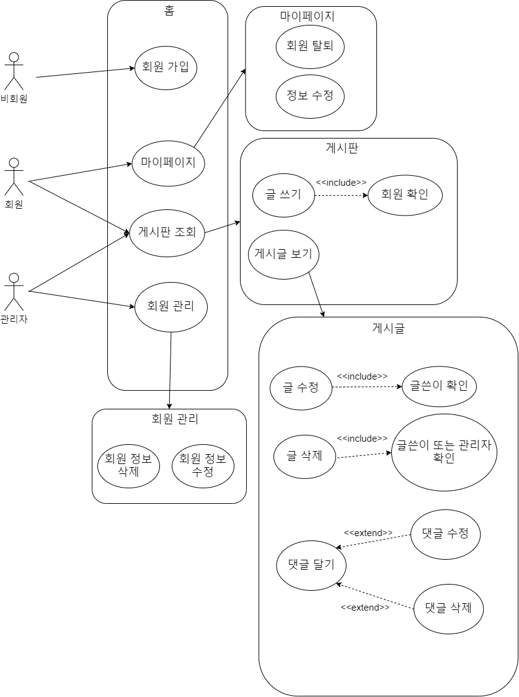
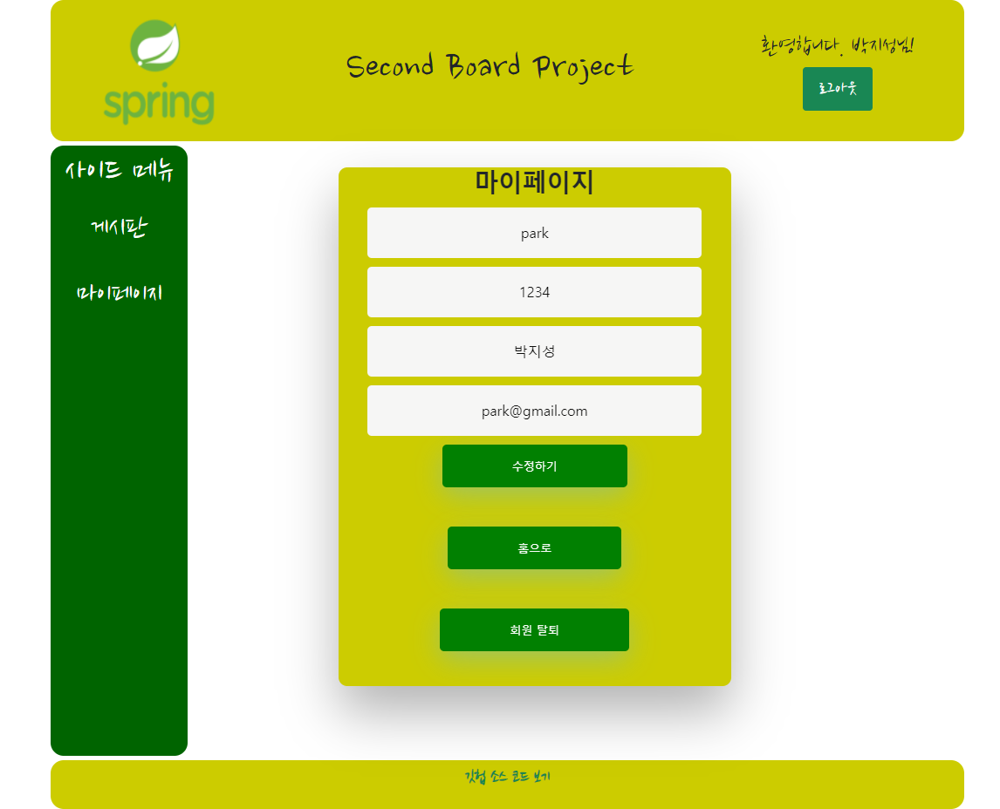

# 두 번째 게시판 만들기

---

## Intro

---

서블릿과 JSP로 구현했던 [첫 게시판 프로젝트](https://github.com/ITHwang/first-board-proj)에 이어, 그간 배운 것들을 활용하여 보다 나은 게시판을 구현했습니다.
개선된 내용은 다음과 같습니다.

1. 스프링 DI/IoC 기능으로 각 클래스가 약한 결합을 이루도록 했습니다.
2. xml 대신 스프링 애너테이션 설정으로 DI/IoC 기능을 간편하게 활용했습니다.
3. JDBC 대신 MyBatis 프레임워크를 통해 xml 파일에 쿼리문을 작성함으로써 가독성을 높였습니다.
4. 빌드 툴인 메이븐 기반으로 웹 프로젝트를 구성하여 자동으로 라이브러리가 관리되도록 했습니다.
5. 아파치 타일즈를 활용하여 JSP 페이지 레이아웃을 보다 쉽게 구현했습니다.

기간은 약 2주 소요되었으며,『자바 웹을 다루는 기술』(이병승 저)의 Chap 30을 적극 참고했습니다.

## Tools

---

<table>
	<tr>
		<td></td>
		<td></td>
		<td></td>
	</tr>
	<tr>
		<td></td>
		<td></td>
		<td></td>
	</tr>
	<tr>
		<td></td>
	</tr>
</table>

## Requirements

---

1. 비회원

    - CRUD 모두 불가능
    - 게시글 조회 시도 시 로그인 창으로 이동
    - 회원 가입 시 다시 로그인 창으로 이동

2. 회원

    - 게시판 활동

        - 내가 쓴 글: CRUD
        - 남이 쓴 글: 읽기만 가능
        - 글 업로드 시 사진 여러 개 추가 기능

    - 마이페이지

        - 조회 및 정보 변경 가능
        - 탈퇴 가능

3. 관리자

    - 게시판 활동

        - 모든 글 읽기 또는 삭제 가능

    - 회원 관리

        - 회원 정보 수정 기능
        - 회원 삭제 기능

## UML Diagram

---

1.  액티비티 다이어그램

    -   로그인 기능

        

    -   게시판 기능

        

    -   마이페이지 기능

        

    -   회원 관리 기능

        

2.  유스케이스 다이어그램

    

## DB

---

| Table 명 | member    |          |              |          |         |                 |
| -------- | --------- | -------- | ------------ | -------- | ------- | --------------- |
| No       | Column 명 | 한글명   | 자료형       | NULL     | key     | 비 고           |
| 1        | ID        | 아이디   | VARCHAR2(10) | NOT NULL | PRIMARY |                 |
| 2        | pwd       | 비밀번호 | VARCHAR2(10) | NOT NULL |         |                 |
| 3        | name      | 이름     | VARCHAR2(50) | NOT NULL |         |                 |
| 4        | email     | 이메일   | VARCHAR2(50) | NOT NULL |         |                 |
| 5        | joinDate  | 가입일자 | DATE         | NOT NULL |         | DEFAULT sysdate |

| Table 명 | board         |                  |                |          |         |                 |
| -------- | ------------- | ---------------- | -------------- | -------- | ------- | --------------- |
| No       | Column 명     | 한글명           | 자료형         | NULL     | key     | 비 고           |
| 1        | articleNO     | 글 번호          | NUMBER         | NOT NULL | PRIMARY |                 |
| 2        | title         | 글 제목          | VARCHAR2(500)  | NOT NULL |         |                 |
| 3        | content       | 글 내용          | VARCHAR2(4000) | NOT NULL |         |                 |
| 4        | imageFileName | 이미지 파일 이름 | VARCHAR2(100)  | NULL     |         |                 |
| 5        | writeDate     | 작성일           | DATE           | NOT NULL |         | DEFAULT sysdate |
| 6        | ID            | 아이디           | VARCHAR2(10)   | NOT NULL | FOREIGN |                 |

| Table 명 | comments  |           |                |          |         |                 |
| -------- | --------- | --------- | -------------- | -------- | ------- | --------------- |
| No       | Column 명 | 한글명    | 자료형         | NULL     | key     | 비 고           |
| 1        | commentNO | 댓글 번호 | NUMBER(10)     | NOT NULL | PRIMARY |                 |
| 2        | content   | 댓글 내용 | VARCHAR2(4000) | NOT NULL |         |                 |
| 3        | writeDate | 작성일    | DATE           | NULL     |         | DEFAULT sysdate |
| 4        | articleNO | 글 번호   | NUMBER         | NOT NULL | FOREIGN |                 |
| 5        | ID        | 아이디    | VARCHAR2(10)   | NOT NULL | FOREIGN |                 |

| Table 명 | imageFile     |                  |              |          |         |                 |
| -------- | ------------- | ---------------- | ------------ | -------- | ------- | --------------- |
| No       | Column 명     | 한글명           | 자료형       | NULL     | key     | 비 고           |
| 1        | imageFileNO   | 이미지 파일 번호 | NUMBER(10)   | NOT NULL | PRIMARY |                 |
| 2        | imageFileName | 이미지 파일 이름 | VARCHAR2(50) | NOT NULL |         |                 |
| 3        | regDate       | 이미지 등록 날짜 | DATE         | NULL     |         | DEFAULT sysdate |
| 4        | articleNO     | 글 번호          | NUMBER       | NOT NULL | FOREIGN |                 |

수정: imageFile 테이블에 'tagName' 칼럼 추가

## 구현 화면

---

### 1. 비회원

-   홈

      

-   회원가입 창

      

### 2. 회원

-   로그인 창

      

-   홈

      

-   게시판

      

-   글쓰기

      

-   게시글 조회

      

-   첨부된 사진

      

-   내 글 조회

      

-   마이페이지

      

### 3. 관리자

-   홈

      

-   게시판 조회

      

-   게시글 조회

      

-   회원 관리

      

## Outro

---

첫 게시판 프로젝트에 비해 여러모로 개선이 되었으나 시간 관계상 해결하지 못한 부분도 있습니다..

1. 계획했던 댓글 기능을 추가하지 못했습니다.
2. 게시글 수정 시 첨부한 사진들 중 일부만 수정할 경우 오류가 발생합니다.~~(수정 화면에서 수정하지 않은 사진까지 불러와 컨트롤러에게 update 요청을 보내야 하는 것이 포인트..)~~

아쉽긴 하지만 앞으로 더 배워야 할 것이 산더미라서.. 다음 웹 프로젝트에서 구현해보겠습니다! 감사합니다!!
